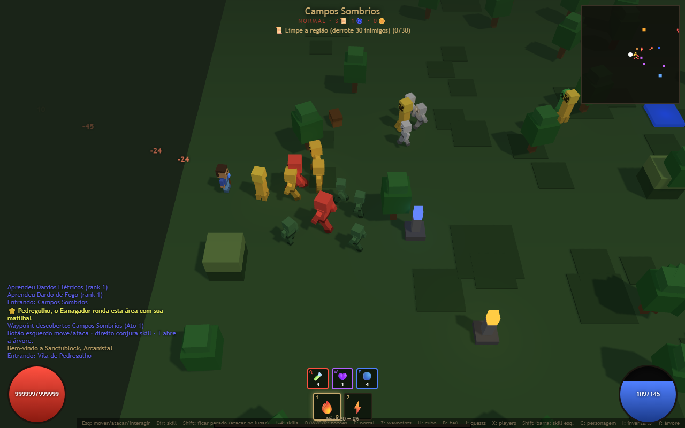

# CubeCraft: Hellblocks 🟩⚔️

ARPG estilo **Diablo II** ambientado no universo **Minecraft**, todo **low-poly**, feito com **Three.js** (sem build, ES modules puros).

> Câmera isométrica, hordas de mobs cúbicos, loot com afixos, soquetes/gemas/runas/joias/runewords, árvore de skills por
> classe, 4 atos com cidades fixas + selvas procedurais, 4 bosses, 3 dificuldades e o secreto **Cow Level** (MOO!).
>
> Personagens low-poly estilo "Steve" (cabeça com rosto, cabelo, mãos e botas); mobs humanoides uniformes
> por cor (esqueletos brancos, zumbis verdes) e **modelos próprios para não-humanoides**: aranha,
> creeper, blaze (flutuante com hastes), ghast (flutuante com tentáculos) e vaca — cada um com animação própria.
> Os **arqueiros** (Arqueiro Esqueleto, Esqueleto Gélido) empunham um **arco** na mão e disparam **flechas finas**.
> Os **NPCs da cidade são Aldeões** (Villagers) — nariz comprido, monocelha e roupão com a cor da profissão.



## Requisitos

- **Navegador moderno com WebGL**: Chrome, Edge ou Firefox.
- **Internet na primeira carga**: o Three.js vem do **CDN unpkg** por importmap (`index.html`) e fica em cache depois. (Para uso offline, baixe o `three.module.js` e ajuste o importmap para um caminho local.)
- **Um servidor estático** (os módulos ES **não** carregam via `file://`). O jeito documentado usa **Node.js 18+** (testado no v24) via `npx serve`, mas qualquer servidor estático serve.
- **Sem build nem instalação** para jogar — basta servir a pasta.
- **Para rodar os testes** (`test/`): **Node.js**, `npm install` (puppeteer-core) e o **Google Chrome** instalado (defina a variável `CHROME_PATH` se ele não estiver no caminho padrão). Veja a seção **Testes**.

## Como rodar

```bash
npm start          # sobe em http://localhost:5173 (= npx serve -l 5173 .)
# ou, com qualquer servidor estático na raiz do projeto, ex.:
#   python -m http.server 5173
```

Abra **http://localhost:5173** no navegador (Chrome/Edge/Firefox).

## Controles (estilo Diablo II)

| Ação | Tecla |
|------|-------|
| Mover / atacar / **interagir** | **Botão esquerdo** (segurar/clicar) |
| Conjurar skill direita | **Botão direito** (segurar) |
| **Ficar parado** e atacar no lugar (Stand Still) | **Shift** (segurar) + ataque |
| Trocar a skill da direita | **1 · 2 · 3 · 4** (clique na barra) |
| Atribuir skill ao **clique esquerdo** | **Shift + clique** na barra |
| **Players X** (ciclar densidade/poder) | **X** |
| Poção de vida · **rejuvenescimento** · mana | **Q** · **W/R** · **E** |
| **Pergaminho de Portal** (volta à cidade e abre retorno) | **F** |
| **Waypoints** (teleporte entre áreas descobertas) | **Z** |
| **Cubo Horadric** (transmutar) | **H** |
| **Baú** de armazenamento | **B** |
| **Log de Quests** | **J** |
| Personagem · Inventário · Árvore de skills | **C · I · T** |
| Fechar painéis / cancelar soquetamento | **Esc** |

Para mudar de zona, **caminhe até um portal** (marcador colorido no chão / minimapa).
**Clique** em NPCs (loja/mercenário), **santuários** (buffs), **baús** (loot) e **waypoints** para interagir.
Na cidade há um portal verde escondido no canto: é a entrada do **Cow Level**. 🐄

## O que está implementado

### Núcleo do ARPG
- **3 classes** com 12–15 skills cada em **3 sub-árvores** (tiers por nível, pré-requisitos, sinergias) — estilo D2:
  - 🛡️ **Guardião** — Auras de Combate · Combate Sagrado (Zelo, Investida, Martelo Bento, **Vingança** multi-elemento) · Auras Defensivas (invoca **Espíritos Sagrados**)
  - 🔮 **Arcanista** — Fogo · Gelo · Raio (com **Maestrias** elementais, **Teleporte** e invocação de **Hidra**)
  - 🏹 **Caçadora** — Arco e Flecha (Tiro Múltiplo, **Flecha Congelante**, Saraivada) · Armadilhas · Agilidade (invoca **Valquíria**)
- **Invocações (summons)** aliadas que lutam ao seu lado, com vida/duração próprias (Espíritos, Hidra estacionária de fogo, Valquíria guerreira).
- **Maestrias elementais** (passivas do Arcanista): Maestria do Fogo/Gelo/Raio amplificam o dano daquele elemento.
- **Skills em ambos os botões**: skill direita (1–4) e skill esquerda (Shift+clique), como no D2.
- **4 Atos** com **cidades FIXAS** (layout determinístico) e **selvas procedurais** (geração por seed).
- **Mundo conectado estilo D2**: a cidade liga a uma **cadeia de mapas** — cidade → selva 0 → selva 1 → … → **arena do boss** — cada zona com um portal de volta à cidade e um portal "adiante". A **cidade é um perímetro seguro** (monstros não entram; uma regra do loop garante isso) e a **entrada da selva** vinda da cidade tem um buffer sem monstros.
- **Waypoints em todos os mapas**: a cidade tem o **portal de waypoint** e **cada mapa** (cada selva e a arena do boss) tem o seu, descoberto ao entrar. Pela tecla **Z** dá para teleportar entre quaisquer waypoints descobertos (cidade/selva/boss).
- **4 Bosses** de ato (Mandíbula Pútrida, Senhor das Brasas, Mãe do Vazio, Wither Ancião) + **Rei das Vacas** no Cow Level — entram em **FÚRIA** abaixo de 33% de vida (+dano/+velocidade, brilho vermelho).
- **Level 1 → 99** com curva de XP crescente, pontos de atributo e de skill por nível.
- **3 Dificuldades**: Normal → Pesadelo → Inferno (escala vida/dano/XP, penalidade de resistência, imunidades elementais) — desbloqueadas ao zerar o ato final, reiniciando o mundo mais cruel.
- **Comando "Players X"** (tecla **X**): aumenta a vida e o XP dos monstros (1/3/5/8), como no D2 single-player.
- HUD completo: globos de vida/mana, barra de skills com recarga (L/R), **cinto de poções clicável**, XP, minimapa (mobs/itens/interativos/saídas), log de combate, dano flutuante, indicadores de buffs/quest/mercenário.
- **Barra de vida de boss/super-único** no topo e **nome + vida do inimigo sob o cursor** (cor por raridade), como no D2.

### Itens & loot (lógica Diablo II)
- **Qualidades**: branco (normal) · azul (mágico, 1–2 afixos) · amarelo (raro, 3–6) · verde (set) · dourado (único).
- **Afixos por *item level***, com prefixos/sufixos e restrições por slot, incluindo os clássicos:
  **+Todas as Skills**, **Conjuração Rápida (FCR)**, **+Todos os Atributos**, **Golpe Mortal**, **+Máx. de Resistências**, Precisão, resistências, roubo de vida, Magic Find, etc.
- **Afixos de combate**: **Golpe Esmagador** (dano = fração da vida atual do monstro), **Ferida Aberta** (sangramento/DoT), **Espinhos** (reflete dano físico ao atacante), **Recuperação Rápida (FHR)** (reduz lentidão) e **Não Pode Ser Congelado**.
- **Afixos de sustain**: **Vida por Morte** e **Mana por Morte** (recuperam ao matar inimigos).
- **Bônus de Conjunto (Set) com bônus *crescentes***: cada peça extra do mesmo set adiciona um novo bônus (ex.: *Arsenal do Esqueleto*, 3 peças → 2/3 dá +destreza/+vel. ataque, 3/3 acrescenta +1 Todas as Skills, crítico e dano de gelo). Sets de 2 peças (Traje do Minerador, Pele do Lobo) e o de 3 peças coexistem.
- **Requisitos de Força/Destreza** para equipar (além do nível) — como no D2.
- **Durabilidade**: itens se desgastam em combate e **quebram** (perdem o bônus) — repare no **Ferreiro** por ouro.
- **Itens Etéreos**: +50% nos status base, mas durabilidade reduzida e **não reparáveis**.
- **Itens Superiores**: itens normais podem vir "Superiores" com bônus aos status base (qualidade do D2).
- **12 Uniques e 3 Sets** fixos (ex.: O Bloco Ancestral, Coroa do Creeper, Presa da Aracne, Anel do Definhamento, **Punho do Golem**, **Cinto do Vazio**, **Carapaça do Wither**, **Cetro do Caos**; conjuntos Traje do Minerador, Pele do Lobo e o **Arsenal do Esqueleto** de 3 peças, com bônus por nº de peças).
- **Charm único Anihilus** (+1 todas skills, +atributos, +resist.) — recompensa garantida ao matar o Rei das Vacas.
- **Identificação**: raros/sets/uniques caem *não-identificados* (afixos ocultos) — use **Pergaminhos de Identificação** (clique no item). Mágicos já vêm identificados, como no D2.
- **Charms (Talismãs)** pequeno/grande/imenso — dão bônus passivos **enquanto ficam no inventário**.
- **Soquetes + Gemas + Runas + Joias + Runewords**:
  - Itens (armas/armaduras/elmos/escudos) podem ter **soquetes**; os mods de gemas/runas variam se a base é arma ou armadura.
  - **35 gemas** (7 tipos × 5 qualidades) e **17 runas**, que caem dos monstros (runas altas via Cubo).
  - **Joias (Jewels)** — item encravável **com afixos próprios** (mágicas/raras com prefixos+sufixos), que dão o **mesmo bônus em arma ou armadura** (encravam em qualquer soquete). Raras caem para identificar.
  - **Facetas Arco-Íris** (joias **únicas** de Fogo/Gelo/Raio): dano + resistência do elemento e **+1% ao máx. de todas as resistências**.
  - **14 Runewords**: sequências exatas de runas em itens com soquetes certos dão bônus poderosos (Steel, Stealth, Lore, Ancient's Pledge, Spirit, Insight, Leaf, Malice, Smoke, **Zephyr**, **Rhyme**, **Black**, **Wealth**, **Heart of the Oak**).
- **Cubo Horadric** com receitas de transmutação:
  - 3 gemas iguais → gema de qualidade superior
  - 3 runas iguais → runa superior
  - 3 gemas + item sem soquete → adiciona soquetes
  - 1 item raro + 1 gema → re-rola o raro
  - 1 item mágico + 1 gema → re-rola o mágico
  - runa **Hel** + item encravado → esvazia os soquetes
- **Baú de armazenamento (Stash)** com **abas infinitas** (48 espaços por aba; cria abas sob demanda) e botão de **Organizar**.
- **Gerência do inventário**: botão **Organizar** (ordena por categoria → raridade → nível requerido) e **arrastar-e-soltar** (drag-and-drop) para **reordenar** itens, **equipar** soltando num slot de equipamento, ou **jogar no chão** numa zona de descarte. Item solto só pode ser recoletado depois que o jogador se afasta (evita pegá-lo de volta na hora).

### Monstros & mundo
- **Ranks** normal/campeão/único/boss, com **afixos de monstro** (Veloz, Encantado-Fogo, Pele de Pedra, etc.), **imunidades elementais** (dificuldades altas) e resistências.
- **Monstros Super Únicos** nomeados com matilha (estilo Bishibosh/Rakanishu) — ex.: "Pedregulho, o Esmagador", "Aracne Rainha".
- **Aura de matilha**: monstros únicos/super-únicos reforçam aliados próximos (+dano e +velocidade), como os packs de elite do D2.
- **Santuários (Shrines)** na selva: buffs temporários (+experiência, +dano, velocidade, defesa, regen de mana) ou restauro de vida/mana.
- **Baús** clicáveis com loot.
- **Waypoints** como **portais de teleporte** (base de pedra, pilares e portal azul brilhante) — um em cada mapa, descobertos ao entrar e ligados ao sistema de viagem (tecla **Z**).

### Cidade, economia & companheiros
- **Vila de planície (Ato I)** no capricho do Minecraft: casas de tronco+gesso com telhado de duas águas, **poço** central, **sino** da vila, **postes-lanterna**, **barraca de mercado**, **forja** (bigorna + lava), **fazenda** cercada de trigo com **fardos de feno**, animais, caminhos de cascalho, árvores e flores. A saída para a selva é um **portão** na borda da vila (pilares de pedra, viga de madeira e cercas), no fim da estrada principal. (Atos II–IV mantêm a praça de pedregulho.)
- **NPCs são Aldeões (Villagers)**: cabeça grande com nariz comprido e monocelha, roupão e braços cruzados, com a **cor da profissão** (Ferreiro = avental de couro, Curandeira = clérigo roxo, Mercador = avental azul de mercador).
- **Lojas + Aposta (Gambling)**: Ferreiro/Mercador vendem itens e consumíveis e **compram** os seus; o **Ferreiro repara** e **imbui** (transforma um item normal em raro, estilo Charsi); o Mercador deixa **apostar** por itens misteriosos (chance de raro/único).
- **Mercenário (hireling)**: contratado na Curandeira, luta ao seu lado (Arqueira, Guarda, Lobo de Ferro, Bárbaro — por ato); pode morrer e ser revivido por ouro, e você pode **equipá-lo** com arma/armadura/elmo (escala dano e vida).
- **Companheiros como alvos reais**: os monstros miram e ferem o mercenário e as invocações (que podem **morrer**), não só o jogador — escolhem o alvo mais próximo.
- **Auras de mercenário**: cada tipo concede um buff ao jogador enquanto vivo (Guarda → Vigor/+dano, Arqueira → +crítico, Lobo de Ferro → regen de mana, Bárbaro → +dano/+defesa).
- **Reespecialização (respec)**: na Curandeira, devolve todos os pontos de skill e de atributo por ouro (estilo "Token of Absolution" do D2).
- **Pergaminho de Portal (Town Portal)**: volta à cidade e abre um portal de retorno para o ponto exato.
- **Poções**: vida, mana e **rejuvenescimento** (restaura vida + mana).
- **Cadeia de quests por ato** (limpar a região · ativar um santuário · derrotar o boss) com recompensas variadas (+skill, +atributos, ouro) — log de quests na tecla **J**.
- **Telas de lore por ato**: ao entrar num novo ato, uma narrativa curta ambienta a história (estilo D2).
- **Penalidade de morte**: perde 10% do ouro; e **perde XP** em Pesadelo/Inferno (sem descer de nível), como no D2. O Cow Level dá um charm garantido como recompensa secreta.

### Personagem & persistência
- **Salvar/Carregar com 3 slots de personagem**: cada personagem é salvo em `localStorage` num **slot** próprio (autosave ao subir de nível, aprender skill e entrar na cidade). A tela inicial mostra os **3 slots** — cada slot cheio traz um resumo (classe/nível/ato/dificuldade) com **Continuar** e **Apagar**; slots vazios criam um **novo personagem**. (O save antigo de slot único é migrado para o Slot 1.)
- **Modo Hardcore**: opção na criação — ao morrer, o personagem é **apagado permanentemente** (morte permanente do D2).
- **Títulos por dificuldade**: ao vencer o ato final em cada dificuldade, ganha um título (Normal → Sir/Dama, Pesadelo → Conde(ssa), Inferno → Barão/Baronesa), exibido no HUD e na ficha.
- **Aura ativa única** (Guardião): escolhe-se **uma** aura ativa por vez na árvore de skills (estilo Paladino do D2); passivas sempre valem.
- **+Todas as Skills** de itens eleva o rank efetivo das skills aprendidas (mostrado na árvore).

### Combate
- Físico + elementos (fogo/gelo/raio/veneno/mágico) com **resistências** (cap 75%, +máx por afixo), **crítico**, **roubo de vida**, **esquiva**, **bloqueio**, e status: **lentidão / atordoamento / queimadura**.
- **Seleção tolerante de inimigos**: cada monstro tem uma hitbox 3D generosa (não só os cubinhos do corpo), com fallback por proximidade do cursor; projéteis usam colisão por varredura (sem atravessar inimigos rápidos).
- Skills: projéteis, multishot, novas, áreas no chão (meteoro/nevasca/armadilhas), raio em cadeia, investida, buffs e auras (sempre ativas, simplificado). **Flechas** (skills de arco e arqueiros) são projéteis **finos e alongados**, orientados na direção do voo; bolts mágicos giram.

## Estrutura

```
src/
  core/      engine (render/loop iso), input (controles D2), blocks (modelos low-poly + props), rng (seed)
  data/      classes, skills, items, monsters, acts (+lore), gems (gemas/runas/runewords), shrines, quests
  systems/   combat, loot, skilltree, leveling, difficulty, economy, sockets, cube, save
  entities/  player (3 classes), monster (+ boss/super único), mercenary, summon
  world/     town (cidades fixas), generator (selva/arena/cow procedurais + interativos)
  ui/        ui.js (HUD + painéis: char/inv/árvore/loja/merc/cubo/stash/waypoints), style.css
  main.js    Game: orquestra tudo (loop, controles, progressão de atos/dificuldades, interativos)
```

## Testes

```bash
node test/logic.test.mjs   # 119 checagens de lógica pura (XP, loot, afixos, skills, dificuldade, soquetes, runewords, cubo, durabilidade, etéreo, superior, aura, sets, summons, quests, FHR, sustain, lore, maestrias, charm único, teleporte/vingança, joias/facetas, set de 3 peças, runewords novas, organizar inventário)
node test/smoke.mjs        # smoke headless (Chrome): boota, joga, skills L/R, teleporte, stand-still, hitbox, hover/boss-bar, imbuir, títulos, summons, quests, lore, loja/reparo, merc+equip+aura, companheiros-alvo, respec, players X, soquetes, cubo, joias/facetas/set-3-peças, arco/flecha, baú-abas/organizar/drag-and-drop, mundo conectado (cidade segura/cadeia/waypoint em cada mapa/travel), hardcore, super único, 3 slots de save, save/continuar, cow, boss
node test/screenshot.mjs   # captura screenshots do jogo renderizando (selva, árvore, loja, cubo)
```

`smoke.mjs`/`screenshot.mjs` usam o Chrome do sistema via `puppeteer-core`
(defina `CHROME_PATH` se necessário) e exigem o servidor rodando em `:5173`.
Status atual: **logic 119/119** e **smoke sem erros de runtime** (WebGL via swiftshader no headless),
incluindo save/load com recarga de página e o botão **Continuar**.

## Notas / limitações honestas

- O Three.js carrega do **CDN** (importmap em `index.html`). Para uso offline, baixe o
  `three.module.js` e ajuste o importmap para um caminho local.
- O **balanceamento** (HP/dano/curva de XP/preços) está calibrado para uma demo jogável, não para a
  economia exata do D2 — ajustável nas tabelas em `src/data/` e `src/systems/difficulty.js` / `economy.js`.
- As árvores têm **~12–15 skills por classe** (Arcanista 15 · Guardião 14 · Caçadora 12; o D2 tem 30) — extensão fácil em `src/data/skills.js`.
- Verificado em Chrome headless com renderizador de software (swiftshader): o caminho WebGL inicializa e
  renderiza, mas o *feel* em GPU real e o controle por mouse de fato só se confirmam jogando.

## Próximos passos naturais

- Completar as 30 skills por classe, troca de armas (weapon swap), mais auras de
  mercenário selecionáveis (estilo Ato 2) e ainda mais uniques/sets/joias.
